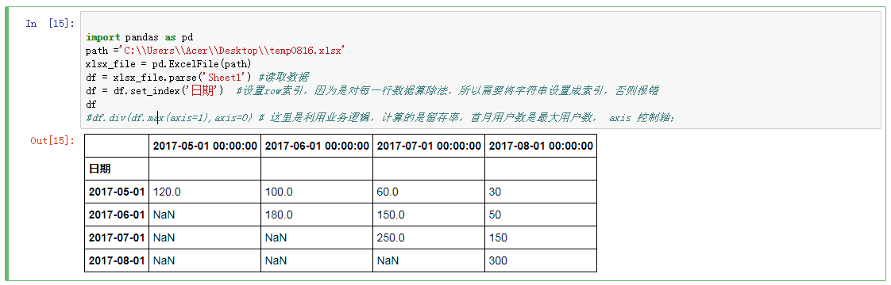
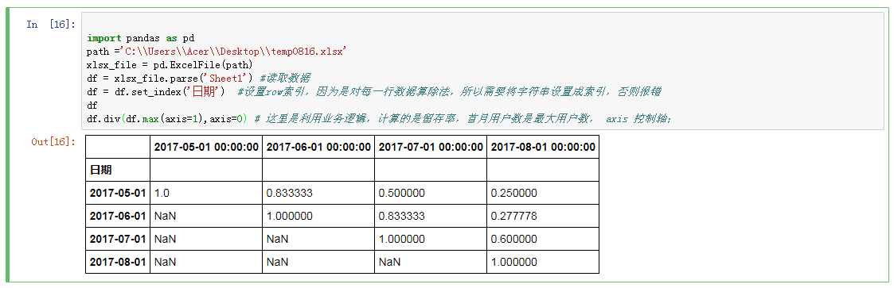
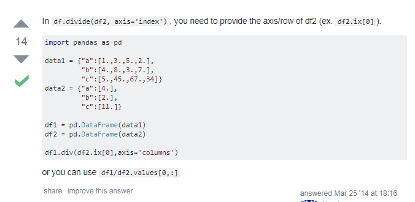
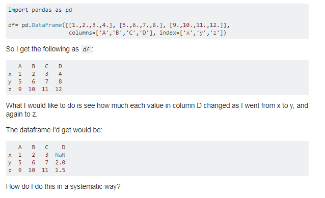
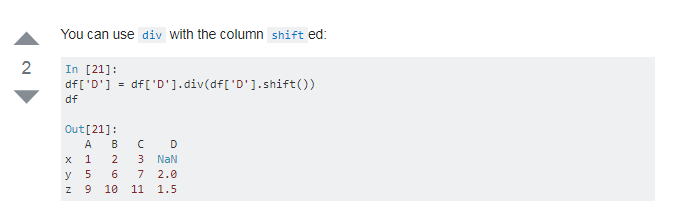
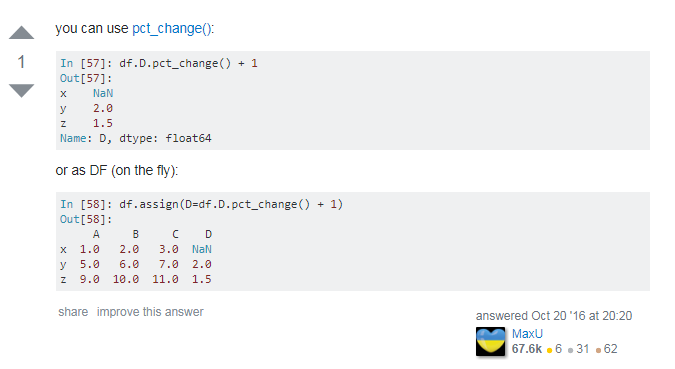

# pandas 计算留存率

* 原始数据集


* 计算留存率



## 引申

* DataFrame 数据除以同一行数据；
```python
import pandas as pd
data = {
        'year': [2012, 2013, 2014, 2015, 2016],
        'reports': [4, 24, 31, 2, 3],
        'coverage': [25, 94, 57, 62, 70]}

df = pd.DataFrame(data,columns =['year','reports','coverage']
                  )
df = df.set_index('year')
weights = df.pop('coverage')
#想要 results/weights
df.div(weights, axis=0)

#The default is axis=1

```
* python-divide-each-row-of-a-dataframe-by-another-dataframe-vector



## how-to-perform-division-by-row-in-a-pandas-dataframe





