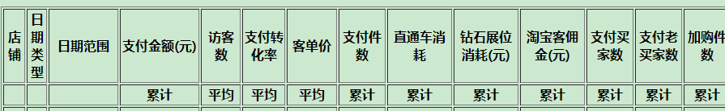

# python 发送邮件

## 发送邮件类

```python
# -*- coding: utf-8 -*-
"""
Created on Thu Jun 29 13:34:03 2017

@author: Acer
"""

import smtplib
import email.mime.multipart
import email.mime.text
from email.header import Header
import pandas as pd
from datetime import datetime
import os
import requests
from email.mime.application import MIMEApplication
from email.mime.base import MIMEBase
from email.mime.text import MIMEText
from email import encoders
from bs4 import  BeautifulSoup


class send_email():
    def __init__(self):
        reporttime = datetime.today().strftime("%Y-%m-%d")
        self.receive=['',''] #收件人
        self.msg = email.mime.multipart.MIMEMultipart()
        self.msg['from'] = '' #发件人

    def send(self):
        try:
            server = smtplib.SMTP()
            server.connect('smtp.exmail.qq.com', '25') #邮箱服务器和端口
            server.login('gitstep@gmail.com', '******') #发件邮箱和登陆密码
            txt = email.mime.text.MIMEText(self.content,'html', 'utf-8')
            self.msg.attach(txt)
            self.msg['From'] = Header('数据支持部', 'utf-8')
            self.msg['To'] = ','.join(self.receive)
            self.msg['Subject'] = Header(self.subject, 'utf-8')
            server.sendmail('gitstep@gmail.com', self.receive, self.msg.as_string())
            server.quit()
            print('发送成功')
        except:
            print('发送失败')
            raise

    def putfu(self,path):
        filename = os.path.basename(path)
        att1 = email.mime.text.MIMEText(open(path, 'rb').read(), 'base64', 'utf-8')
        att1["Content-Type"] = 'application/octet-stream'
        att1["Content-Disposition"] = 'attachment; filename='+filename
        self.msg.attach(att1)

    def put_xlsx(self,path):
        file_name = os.path.basename(path)
        part = MIMEBase('application', "octet-stream")
        part.set_payload(open(path, "rb").read())
        encoders.encode_base64(part)
        part["Content-Type"] = 'application/octet-stream'
        part.add_header('Content-Disposition', 'attachment', filename=('utf-8', '', file_name))
        #part.add_header('Content-Disposition', 'attachment; filename="operate.xlsx"')
        #part.add_header('Content-Disposition', 'attachment; filename="%s"'%Header(filename,'utf-8'))
        self.msg.attach(part)

    def weather(self):
        response = requests.get('http://weather.sina.com.cn/pudong')    
        response.encoding = 'utf-8'    
        html = response.text
        soup = BeautifulSoup(html,'lxml')
        city = soup.select('h4.slider_ct_name')[0].get_text()
        date = soup.select('p.slider_ct_date')[0].get_text()
        #degree = soup.select('div.slider_degree')[0].get_text()
        degree = soup.select('div#blk_fc_c0_scroll_w div.blk_fc_c0_i p.wt_fc_c0_i_temp')[0].get_text()
        detail = soup.select('p.slider_detail')[0].get_text(strip=True).replace('\xa0','').replace(' ','')
        return city,date,degree,detail  

```

##  加载脚本

```python
# -*- coding: utf-8 -*-
"""
Created on Thu Jun 29 13:34:03 2017

@author: Acer
"""


# 发送邮件py脚本名字是 auto_email.py 的文件夹需要引入到python环境中
import sys
python_path = 'C:\\import_scripy\\email\\'
sys.path.append(python_path)

import auto_email # 发送邮件py脚本名字是 auto_email.py 需要引入到python环境中
import pandas as pd
from datetime import datetime, timedelta
import os
import time
mail = auto_email.send_email() # 初始化 、实例化

path = 'C:\\import_scripy\\email\\运营报表.xlsx'

xlsx_file = pd.ExcelFile(path)
df_day = xlsx_file.parse('自然日',index=False)
##设置小数位
#如果是float类型，小数位取4位小数
day_float_columns = df_day.dtypes.index [df_day.dtypes == float]
decimal = pd.Series([4],index = day_float_columns)
df_day =df_day.round(decimal)
```
* 以下模块主要是实现本月数据累计



```python
important_columns = [ '店铺', '日期类型', '日期范围', '支付金额(元)', '访客数', '支付转化率','支付件数','客单价', '直通车消耗', '钻石展位消耗(元)', '淘宝客佣金(元)','支付买家数', '支付老买家数', '成功退款金额(元)',
           '支付金额(元)_环比', '访客数_环比', '支付转化率_环比', '支付件数_环比','客单价_环比',
            '支付买家数_环比','直通车消耗_环比','钻石展位消耗(元)_环比']
yesterday = (datetime.date(datetime.now()) - timedelta(days=1)).strftime('%Y-%m-%d')
today = datetime.date(datetime.now()).strftime('%Y-%m-%d')
month_start = pd.date_range(end = today,periods = 1,freq = 'MS')[0].strftime('%Y-%m-%d')
#本月数据
df_yesterday = df_day[df_day['日期'] == yesterday][columns]
df_month =  df_day[df_day['日期'] >= month_start ][columns]
df_month_group = df_month.groupby(['店铺'])
min_date = df_month_group.agg({'日期':['min','max']})['日期']['min'].map(lambda x:x.strftime('%Y-%m-%d'))[0]
max_date = df_month_group.agg({'日期':['min','max']})['日期']['max'].map(lambda x:x.strftime('%Y-%m-%d'))[0]

month = df_month_group.agg({   
                    '支付金额(元)':[('累计','sum')],
                    '直通车消耗':[('累计','sum')],
                    '钻石展位消耗(元)':[('累计','sum')],
                    '淘宝客佣金(元)' :[('累计','sum')],
                    '支付买家数':[('累计','sum')],
                    '支付老买家数':[('累计','sum')],
                    '支付件数':[('累计','sum')],
                    '加购件数':[('累计','sum')],
                       '访客数':[('平均','mean')],
                       '支付转化率':[('平均','mean')],
                       '客单价':[('平均','mean')]                    
        })  
month = month.reset_index()
month['本月数据'] = min_date+'~'+max_date
month = month[[ '店铺','日期类型','日期范围','支付金额(元)', '访客数', '支付转化率', '客单价', '支付件数', '直通车消耗',  '钻石展位消耗(元)','淘宝客佣金(元)','支付买家数', '支付老买家数', '加购件数']]
##设置小数位
#如果是float类型，小数位取4位小数
float_columns = month.dtypes.index [month.dtypes == float]
decimal = pd.Series([4],index = float_columns)
month =month.round(decimal)
```
### 邮件正文

```python
weather = mail.weather()
weather = str(weather)
if isinstance(df_day,str):
    mail.content = "no data! (′⌒`)"
else:
    email = '''
    <h3>您好:</h3>
        <p>运营报表已添加至附件中，请查收！</p>
        <p>数据由运营支持部-数据部门提供，如有问题，请e-mail或者RTX联系<p>
        <p>天气预报：%s</p>

        <p>附注：表格简要信息如下</p>
        <p>本月运营报表简要信息如下<p>
        {month}
        <p>最近7天运营报表如下<p>
        {day}
        '''%(weather)
    mail.content = email.format(day=df_day[important_columns].head(7).to_html(index=False),
                                month = month.to_html(index=False))

mail.receive=['***@163.com','***@qq.com']
mail.msg['from'] = 'gitstep@gmail.com'
mail.subject ='运营报表'
mail.put_xlsx(path)
mail.send()

```
