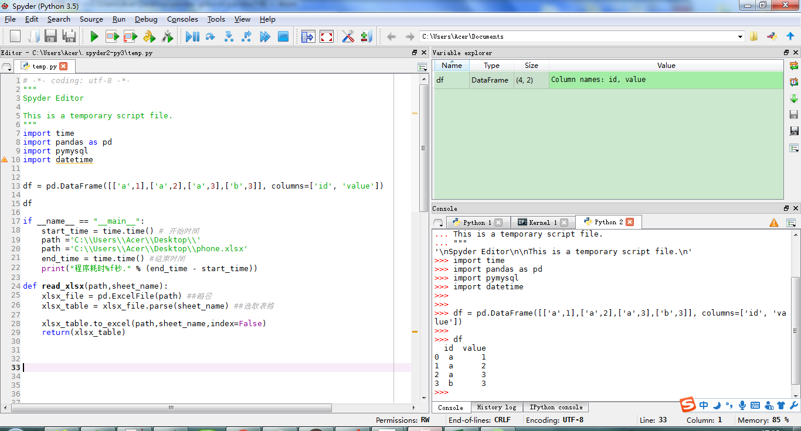
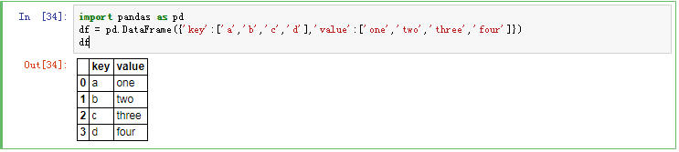

#  简介

pandas 数据预处理包，擅长于二维表数据分析操作；是基于NumPy构建的，让以NumPy为中心的应用变得更加简单。

pandas引人约定
<code>
import pandas as pd
<code>

# pandas 安装

强力推荐使用 anaconda 软件包，里面已经集成了pandas,numpy等其他数据分析包，内置的spyder
编辑器非常适合数据分析；

推荐选择python3版本的anacond,不用纠结编码；

[anaconda下载地址](https://www.continuum.io/downloads)

# 编辑器

spyde边界器界面如下；使用起来超级爽；

pandas创建数据集范例

*说明：本文截图采用Jupyter Notebook软件，其已经内置在anaconda软件安装包中；
