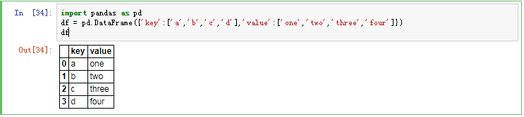

# pandas数据结构

pandas 主要包含2种数据结构: Series和DataFrame

# Series
Series是一种类似于一维数组的对象，它由一组数据(各种NumPy数据类型)以及一组与之相关的数据标签(即索引)组成。仅由一组数据即可产生最简单的Series:

# DataFrame
D ataFrame是一个表格型的数据结构，它含有一组有序的列，每列可以是不同的值类型(数值、字符串、布尔值等)。

