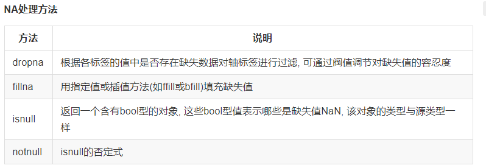
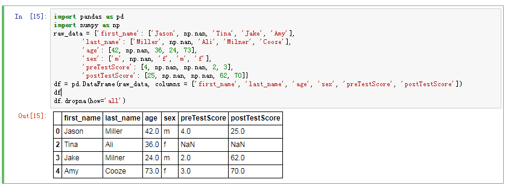
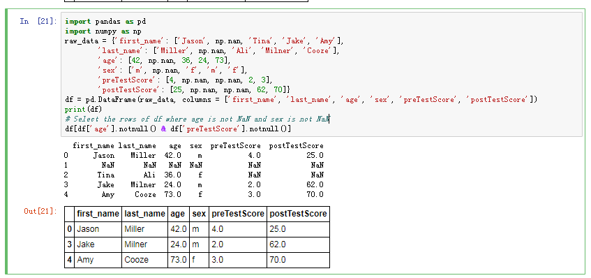

# 缺失值处理

缺失数据在大部分数据分析中很常见. pandas的设计目标之一就是让缺失数据的处理尽量轻松.
pandas使用浮点类型NaN(Not a Number)表示浮点和非浮点数组中的缺失值. 它只是一个标记以便检测

## 清除缺失数据集

Select some raws but ignore the missing data points

* dropna默认丢弃任何含有缺失值的行:
* 传入how='all' 将只丢弃金为NA的那些行:
* 要用这种方式丢弃列，只需传入axis=1 即可;

参考[pandas_missing_data](https://chrisalbon.com/python/pandas_missing_data.html)
[missing_data](https://pandas.pydata.org/pandas-docs/stable/missing_data.html)
