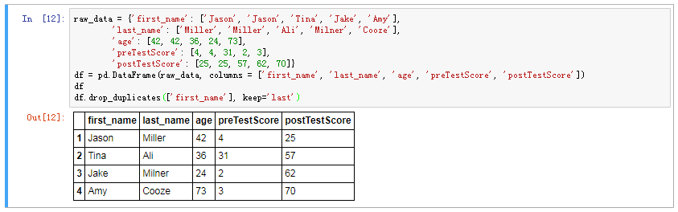

# 数据预处理


## drop_duplicates



drop_duplicates 方法默认会判断全部列,可以指定部分列进行重复项判断,
drop_duplicates默认保留的是第一个出现的值组合，传入参数``` keep='last' ``` 则保留最后一个；
```python
raw_data = {'first_name': ['Jason', 'Jason', 'Tina', 'Jake', 'Amy'],
        'last_name': ['Miller', 'Miller', 'Ali', 'Milner', 'Cooze'],
        'age': [42, 42, 36, 24, 73],
        'preTestScore': [4, 4, 31, 2, 3],
        'postTestScore': [25, 25, 57, 62, 70]}
df = pd.DataFrame(raw_data, columns = ['first_name', 'last_name', 'age', 'preTestScore', 'postTestScore'])
df
df.drop_duplicates(['first_name'], keep='last')
```
