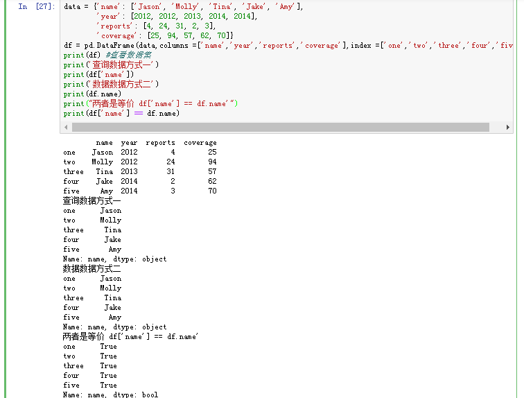
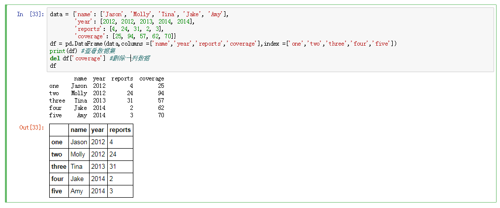
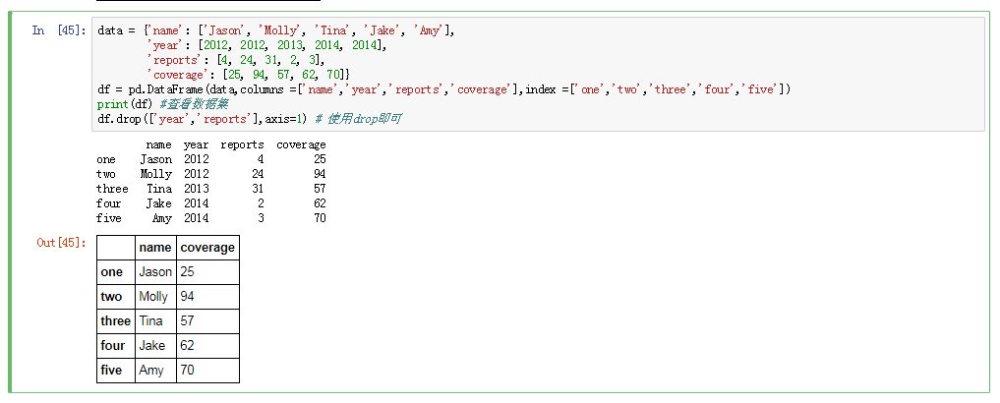

# 变量筛选查询
DataFrame进行索引其实就是藐取一个或多个列:
## 查询、选择变量
### 选择单列
可以使用 df.column 或者 df['column']

### 选择多列
> ``` df[['column_1','columns_2']]```


## 删除变量
```del df['column'] ```



* 引申：若要删除指定columns，可以使用drop方法，但需传入axis=1

