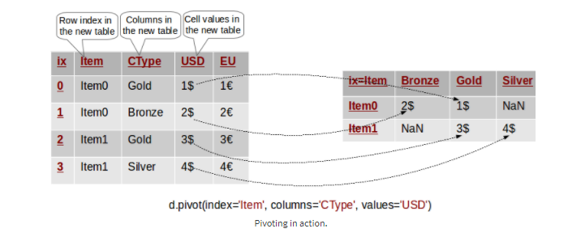
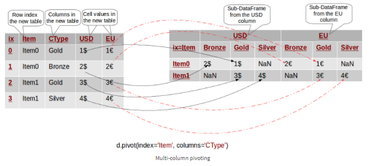
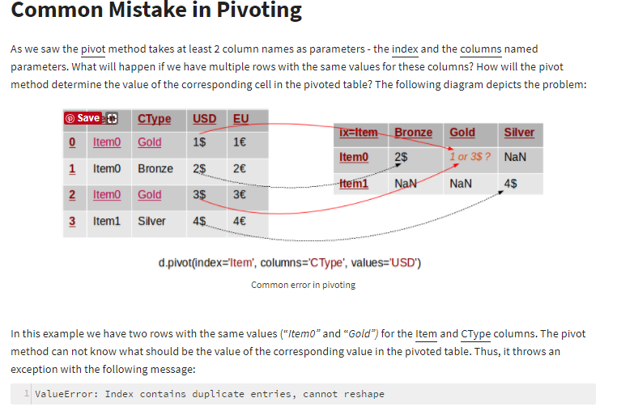
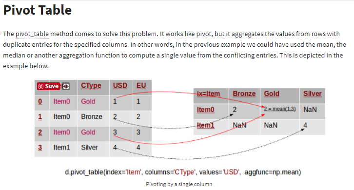
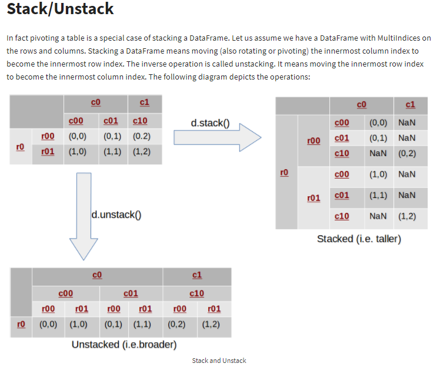

# 整合与重构

[Reshaping in Pandas - Pivot, Pivot-Table, Stack and Unstack explained with Pictures](http://nikgrozev.com/2015/07/01/reshaping-in-pandas-pivot-pivot-table-stack-and-unstack-explained-with-pictures/)

## Pivot

## Pivoting By Multiple Columns

## Common Mistake in Pivoting

## Pivot Table

## Stack/Unstack

参考资料
[Pandas中的数据重塑（reshape）功能](http://datartisan.com/article/detail/104.html)
[reshaping-data-in-python](https://hackernoon.com/reshaping-data-in-python-fa27dda2ff77)
