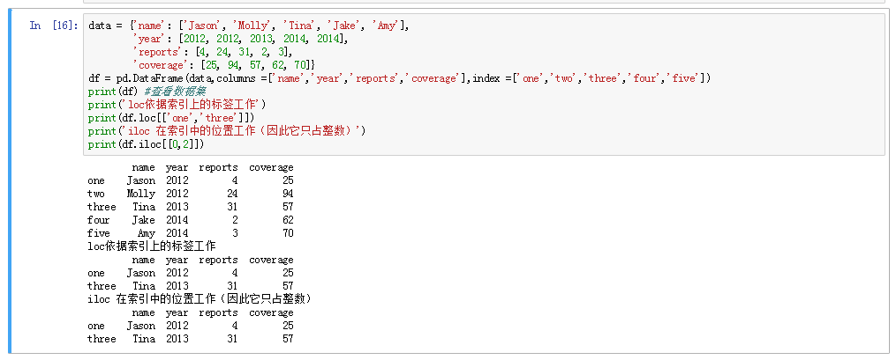
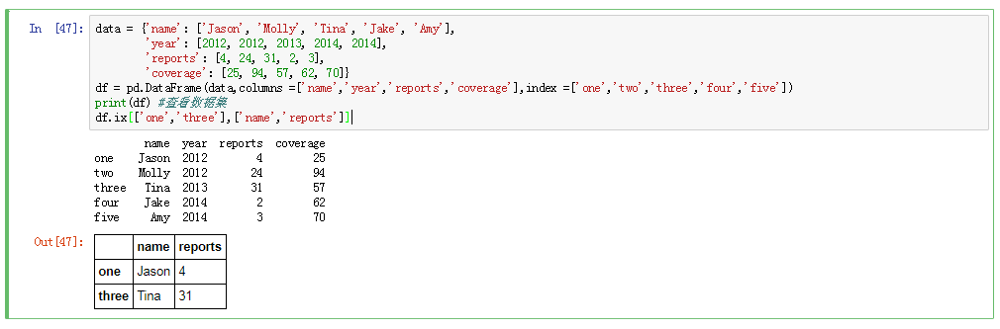
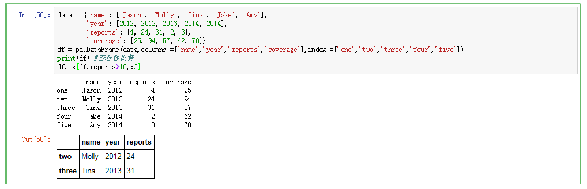
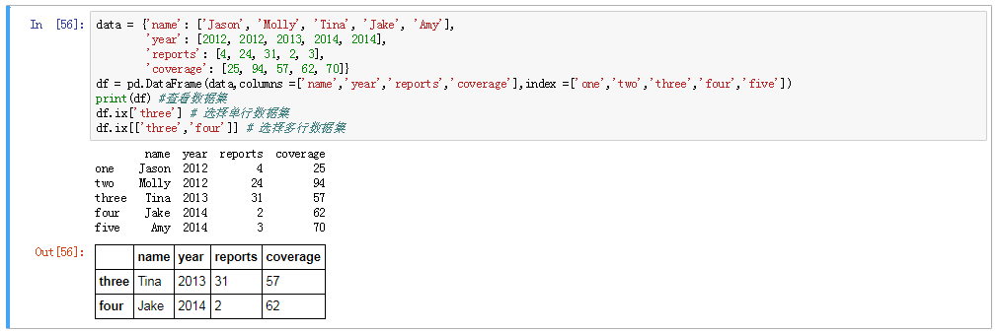
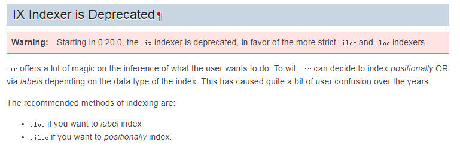
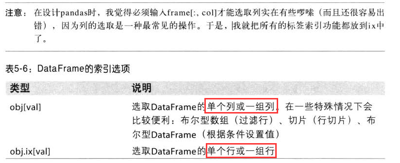

# 查询变量、观测

## 便签索引 loc
推荐使用loc方法选取数据；





## 标签索引 ix

```Python
data = {'name': ['Jason', 'Molly', 'Tina', 'Jake', 'Amy'],
        'year': [2012, 2012, 2013, 2014, 2014],
        'reports': [4, 24, 31, 2, 3],
        'coverage': [25, 94, 57, 62, 70]}
df = pd.DataFrame(data,columns =['name','year','reports','coverage'],index =['one','two','three','four','five'])
print(df) #查看数据集
df.ix[['one','three'],['name','reports']]

```
* where 方式筛选数据集


* ix方式选取列





* DataFrame的索引选顷



* loc works on labels in the index.
* iloc works on the positions in the index (so it only takes integers).
* ix usually tries to behave like loc but falls back to behaving like iloc if the label is not in the index.
* 不推荐使用ix,避免发生不可预知的错误；

参考教程：
[pandas-iloc-vs-ix-vs-loc-explanation](https://stackoverflow.com/questions/31593201/pandas-iloc-vs-ix-vs-loc-explanation)
[ix-indexer-is-deprecated](https://pandas.pydata.org/pandas-docs/stable/indexing.html#ix-indexer-is-deprecated)

Note: in pandas version 0.20.0 and above, ix is deprecated and the use of loc and iloc is encouraged instead. I have left the parts of this answer that describe ix intact as a reference for users of earlier versions of pandas. Examples have been added below showing alternatives to  ix.
