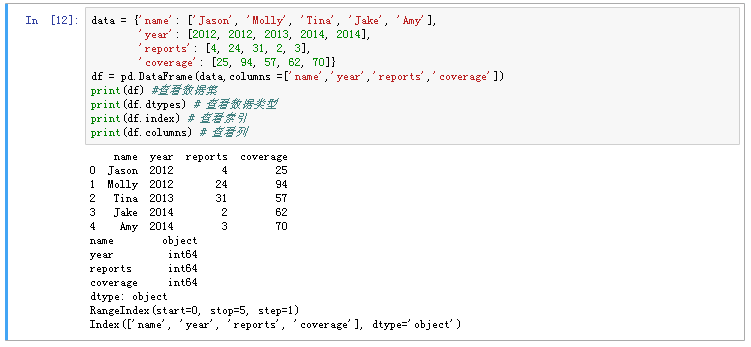
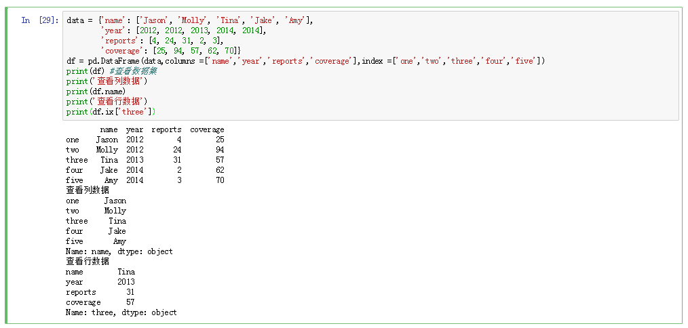

# 索引操作
pandas 在创建数据集时，默认会自动创建索引，且索引是从0开始；
使用索引，可以用于访问对象中的元素；
对DataFrame进行索引其实就是藐取一个或多个列:
利用标签的切片运算与普通的Python切片运算不罔，其末端是包含的




DataFrame既有行索引也有列索引，它可以被看做由Series组成的字典(共用同一个索引)
* 通过索引方式选取单个或者一组值；


```python
data = {'name': ['Jason', 'Molly', 'Tina', 'Jake', 'Amy'],
        'year': [2012, 2012, 2013, 2014, 2014],
        'reports': [4, 24, 31, 2, 3],
        'coverage': [25, 94, 57, 62, 70]}
df = pd.DataFrame(data,columns =['name','year','reports','coverage'],index =['one','two','three','four','five'])
print(df) #查看数据集
print('查询数据方式一')
print(df['name'])
print('数据数据方式二')
print(df.name)
print("两者是等价 df['name'] == df.name'")
print(df['name'] == df.name)

```
* 返回的Series拥有原DataFram巳相同的索引，且其n ame 属'性也已经被相应地设置好了。
* 行也可以通过位置或名称的方式进行获取，比如用索引字段ix

