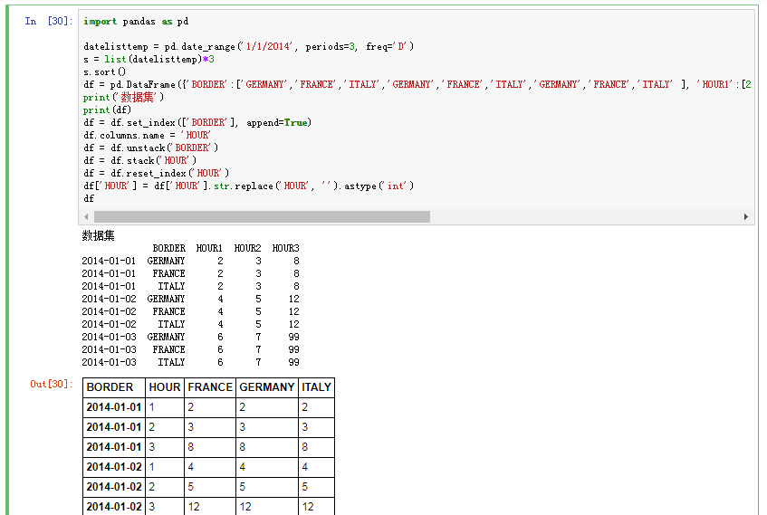

# 索引高级操作

## 层次化索引
层次化索引(hierarchical indexing ) 是pandas的一项重要功能，它使你能在一个轴上拥有多个(两个以上)索引级别。

* 带有Multilndex索引的Series的格式化输出形式。索引之间的"间隔"表示"直接使用上面的标签"

## reset_index 取消层次化索引

## set_index 建立层次化索引

* 默认情况下，那些列会从DataFrame中移除，使用drop=True可保留；

* 层次化索引为DataFrame数据的重排任务提供了一种具有良好一致性的方式。
## stack : 将数据的列"旋转"为行。
## unstack: 将数据的行"旋转"为列。

参考：[how-to-unstack-or-pivot-in-pandas](https://stackoverflow.com/questions/24640399/how-to-unstack-or-pivot-in-pandas)

* 默认情况下， unstack操作的是最内层(stack也是如此) 。传入分层级别的编号或名称即可对其他级别进行unstack操作:
* 如果不是所有的级别值都能在各分组中找到的话，则unstack操作可能会引人缺失数据:

## pivot_table

