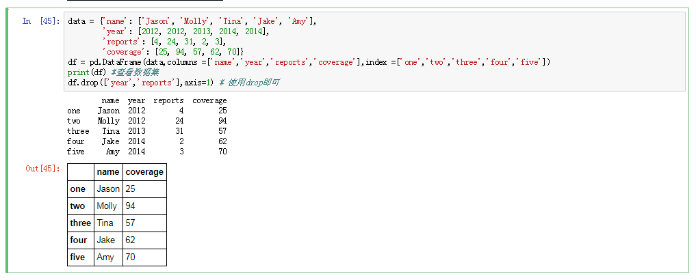

## 选入观测

选入或剔除观测（行）是数据准备和数据分析的一个关键方面

## 布尔型数组选取行
* 方式一


* 方式二


## 切片操作
* 不推荐这种方式


## 删除指定轴上的数据

```df.drop(['column_1','columns_2'])```
默认 axis=0 删除rows数据


* 引申：若要删除指定columns，可以使用drop方法，但需传入axis=1

