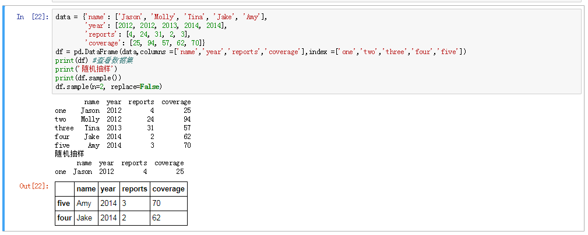

# Selecting Random Samples

参考教程：
[selecting-random-samples](https://pandas.pydata.org/pandas-docs/stable/indexing.html#selecting-random-samples)

A random selection of rows or columns from a Series, DataFrame, or Panel with the sample() method. The method will sample rows by default, and accepts a specific number of rows/columns to return, or a fraction of rows.

* When no arguments are passed, returns 1 row.
* One may specify either a number of rows:
* By default, sample will return each row at most once, but one can also sample with replacement using the replace option:
* By default, each row has an equal probability of being selected, but if you want rows to have different probabilities, you can pass the sample function sampling weights as weights.
