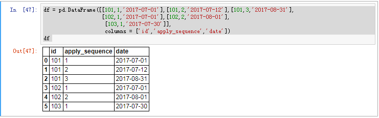
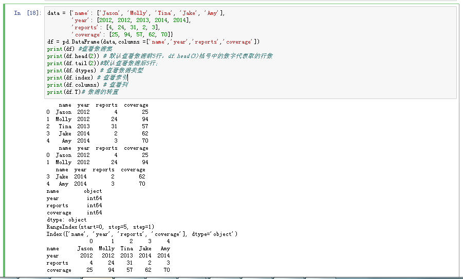

#创建DataFrame数据框

## 数据集基本创建语句



```python
df = pd.DataFrame([[101,1,'2017-07-01'],[101,2,'2017-07-12'],[101,3,'2017-08-31'],
                   [102,1,'2017-07-01'],[102,2,'2017-08-01'],
                    [103,1,'2017-07-30']],
                    columns = ['id','apply_sequence','date'])
df
```
## 数据集基本语法

