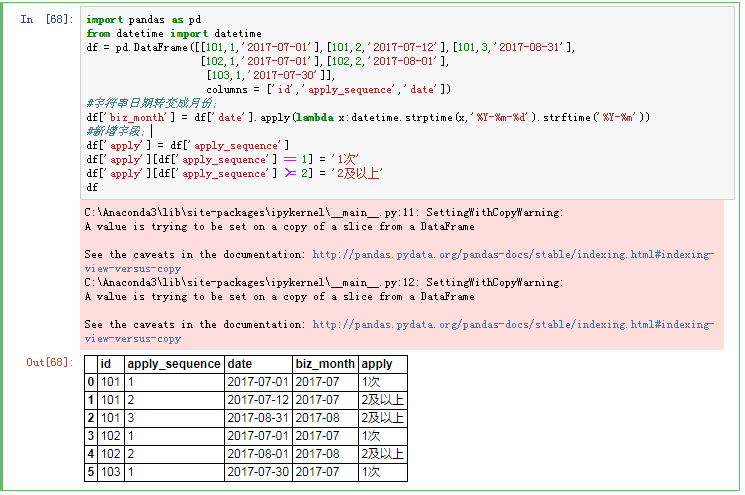

# 创建新变量

研究项目中，你可能需要创建新变量或者对现有的变量进行变换。这可以通过 以下形式的语句来完成:
> 变量名 = 表达式

以上语句中的“表达式”部分可以包含多种运算符和函数

示例：

```python
import pandas as pd
from datetime import datetime
df = pd.DataFrame([[101,1,'2017-07-01'],[101,2,'2017-07-12'],[101,3,'2017-08-31'],
                   [102,1,'2017-07-01'],[102,2,'2017-08-01'],
                    [103,1,'2017-07-30']],
                    columns = ['id','apply_sequence','date'])
#字符串日期转变成月份；                 
df['biz_month'] = df['date'].apply(lambda x:datetime.strptime(x,'%Y-%m-%d').strftime('%Y-%m'))
#新增字段；
df['apply'] = df['apply_sequence']
df['apply'][df['apply_sequence'] == 1] = '1次'
df['apply'][df['apply_sequence'] >= 2] = '2及以上'
df
```
