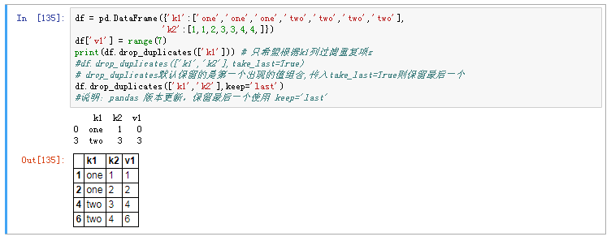
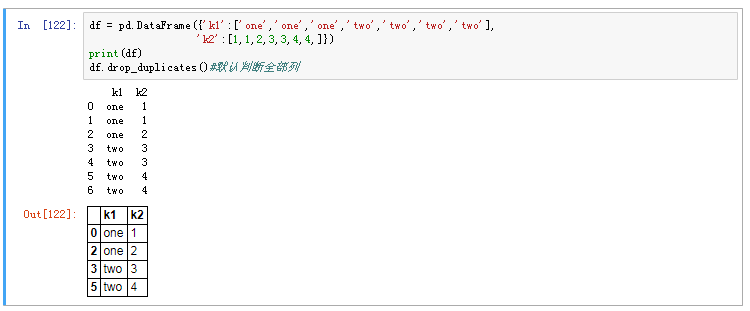

# 删除重复数据

## drop_duplicates
* drop_duplicates 删除重复数据，默认判断全部列，并保留第一个出现的值组合

* 指定部分列进行重复项判断

```python
df = pd.DataFrame({'k1':['one','one','one','two','two','two','two'],
                  'k2':[1,1,2,3,3,4,4,]})
df['v1'] = range(7)
print(df.drop_duplicates(['k1'])) # 只希盟根据k1列过滤重复项z
#df.drop_duplicates(['k1','k2'],take_last=True)
# drop_duplicates默认保留的是第一个出现的值组合,传入take_last=True则保留最后一个
df.drop_duplicates(['k1','k2'],keep='last')
#说明：pandas 版本更新，保留最后一个使用 keep='last'

```
* drop_duplicates 默认判断全部列

```python
df = pd.DataFrame({'k1':['one','one','one','two','two','two','two'],
                  'k2':[1,1,2,3,3,4,4,]})
print(df)
df.drop_duplicates()#默认判断全部列
```
