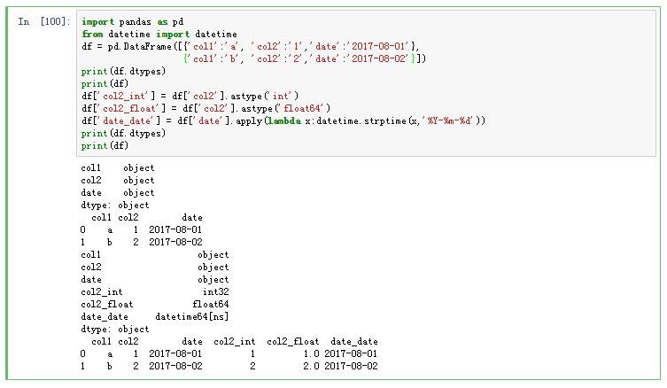

# 变量类型转换

对象的数据类型转换为另一种数据类型的函数。
使用astype如下：
```python
df[[column]] = df[[column]].astype(type)
```
type即int、float等类型。


```python
import pandas as pd
from datetime import datetime
df = pd.DataFrame([{'col1':'a', 'col2':'1','date':'2017-08-01'},
                   {'col1':'b', 'col2':'2','date':'2017-08-02'}])
print(df.dtypes)
print(df)
df['col2_int'] = df['col2'].astype('int')
df['col2_float'] = df['col2'].astype('float64')
df['date_date'] = df['date'].apply(lambda x:datetime.strptime(x,'%Y-%m-%d'))
print(df.dtypes)
print(df)

```
