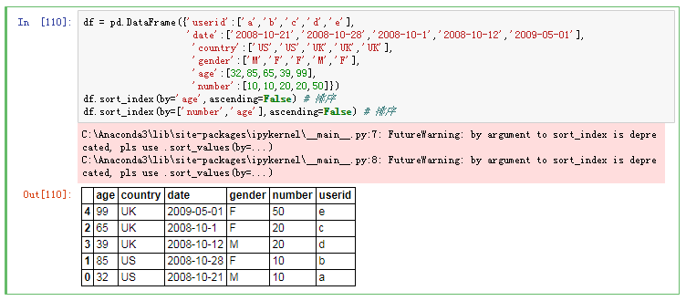
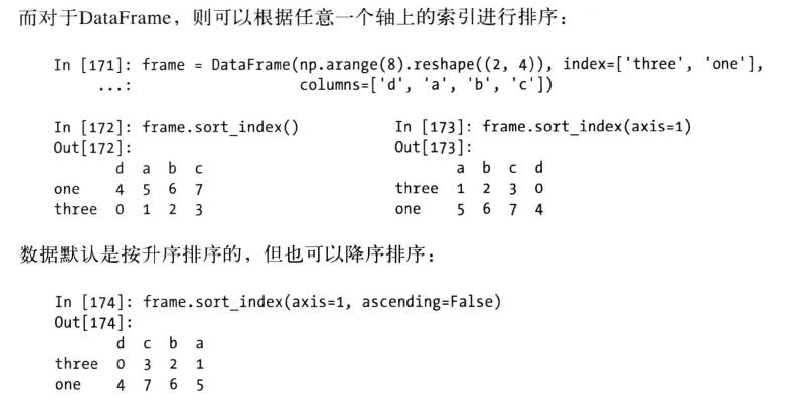
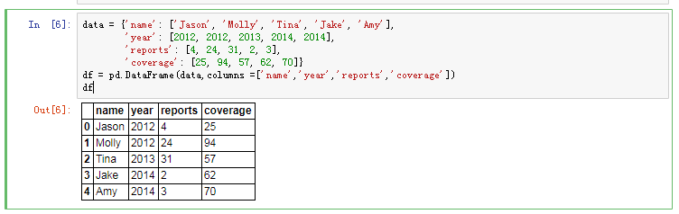
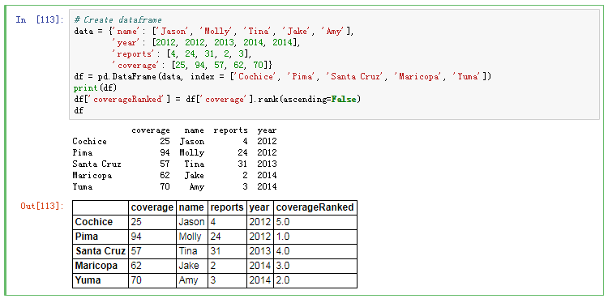
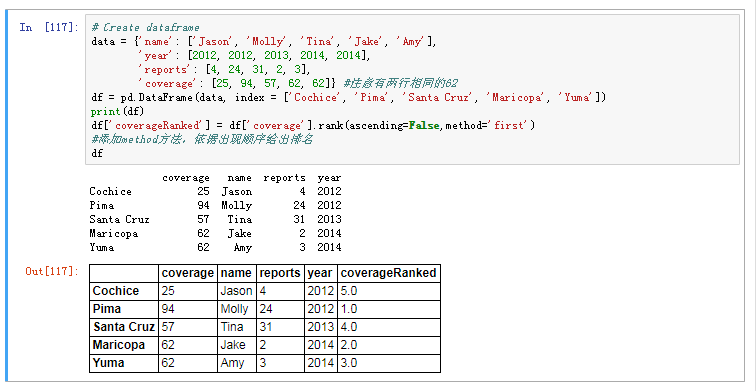
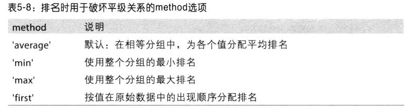

# 数据排序和排名

## 排序更有助于观察数据

根据条件对数据集排序(sorting ) 也是一种重要的内置运算。要对行或列索引进行排序(按字典顺序) ，可使用sort_index方法，它将返回一个已排序的新对象:

### sort_index 值排序（by = [column]）
根据一个或多个列中的值进行排序将一个或多个列的名字传递给by选项即可达到该目的:

```python
df = pd.DataFrame({'userid':['a','b','c','d','e'],
                   'date':['2008-10-21','2008-10-28','2008-10-1','2008-10-12','2009-05-01'],
                    'country':['US','US','UK','UK','UK'],
                    'gender':['M','F','F','M','F'],
                    'age':[32,85,65,39,99],
                    'number':[10,10,20,20,50]})
df.sort_index(by='age',ascending=False) # 排序
df.sort_index(by=['number','age'],ascending=False) # 排序

```
### sort_index 索引排序（axis=0 OR axis=1）
对轴上的索引排序


#### 若需要指定columns的顺序，可使用如下方式：


## 排名(rankìng)
排名(rankìng) 跟排序关系密切，且它会增设一个排名值(从1开始，一直到数组中有效数据的数量)

```python
# Create dataframe
data = {'name': ['Jason', 'Molly', 'Tina', 'Jake', 'Amy'],
        'year': [2012, 2012, 2013, 2014, 2014],
        'reports': [4, 24, 31, 2, 3],
        'coverage': [25, 94, 57, 62, 70]}
df = pd.DataFrame(data, index = ['Cochice', 'Pima', 'Santa Cruz', 'Maricopa', 'Yuma'])
print(df)
df['coverageRanked'] = df['coverage'].rank(ascending=False)
df
```
* 若排名的值相同，可使用method方法，指定排名规则

因存在排名值相同可能，故排名时可能破坏平级关系；

