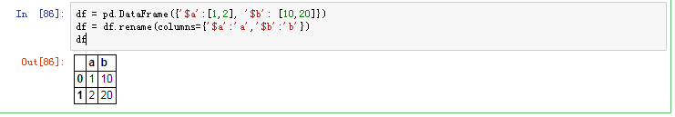
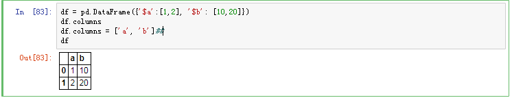

#重命名变量

推荐方法一：rename
rename 可以指定部分变量重命名，使用字典方式，更易理解


```python
df = df.rename(columns={'oldName1': 'newName1', 'oldName2': 'newName2'})
# OR
df.rename(columns={'oldName1': 'newName1', 'oldName2': 'newName2'}, inplace=True)
```

方法二：
获取df.columns后依照顺序重命名变量；



```python
df = pd.DataFrame({'$a':[1,2], '$b': [10,20]})
df.columns
df.columns = ['a', 'b']
df

```
