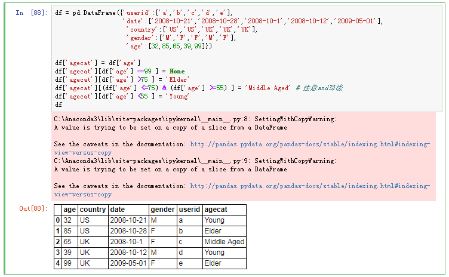

# 重编码变量
重编码涉及根据同一个变量和/或其他变量的现有值创建新值的过程；


```python
df = pd.DataFrame({'userid':['a','b','c','d','e'],
                   'date':['2008-10-21','2008-10-28','2008-10-1','2008-10-12','2009-05-01'],
                    'country':['US','US','UK','UK','UK'],
                    'gender':['M','F','F','M','F'],
                    'age':[32,85,65,39,99]})

df['agecat'] = df['age']
df['agecat'][df['age'] ==99 ] = None
df['agecat'][df['age'] >75 ] = 'Elder'
df['agecat'][(df['age'] <=75) & (df['age'] >=55) ] = 'Middle Aged' # 注意and写法
df['agecat'][df['age'] <55 ] = 'Young'
df
```
