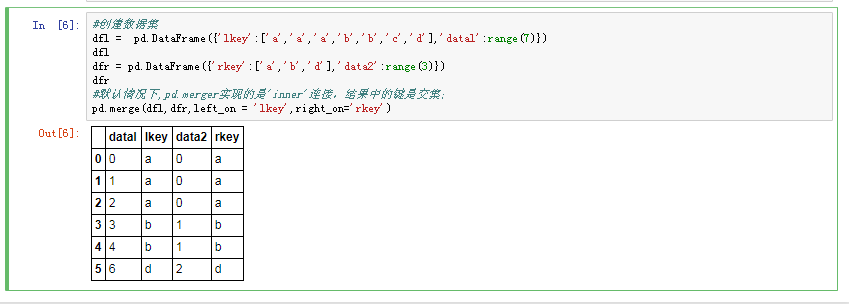
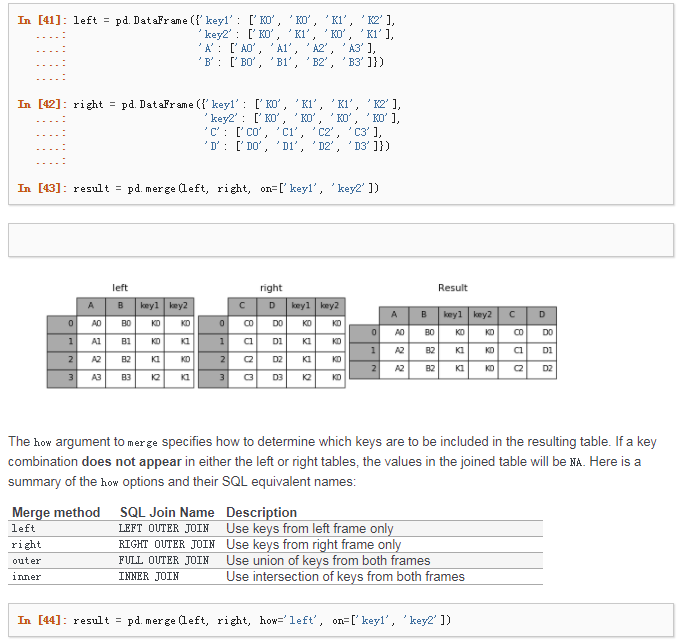

# 合并数据集

* pandas.merge可根据一个或多个键将不同DataFrame中的行连接起来。SQL或其他关系型数据库的用户对此应该会比较熟悉，因为它实现的就是数据库的连接操作。
* pandas.concat可以沿着一条轴将多个对象堆叠到一起。

## 合并数据集

### pd.merge

数据集的合并(merge ) 或连接(join) 运算是通过一个或多个键将行键接起来的。这些运算是关系型数据库的核心。



```
merge(left, right, how='inner', on=None, left_on=None, right_on=None,
      left_index=False, right_index=False, sort=True,
      suffixes=('_x', '_y'), copy=True, indicator=False)
```

* 默认情况下,pd.merger实现的是'inner'连接，结果中的键是交集；
其他方式还有"left",'right'和'outer'。外连接求取的是键的井集，组合了左连接和右连接的效果;
* 合并运算重复列名的处理,的suffixes项，用于指定附加到左右两个DataFrame对象的重叠列上的字符串;

