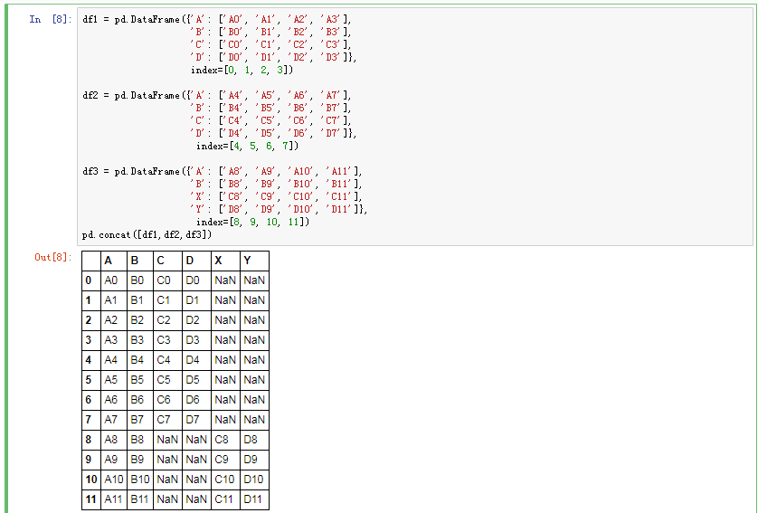
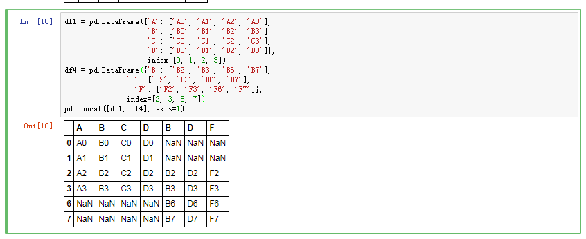
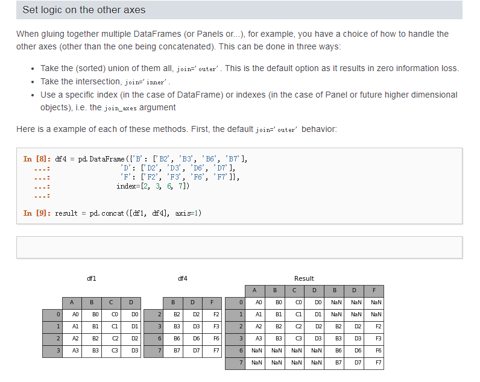
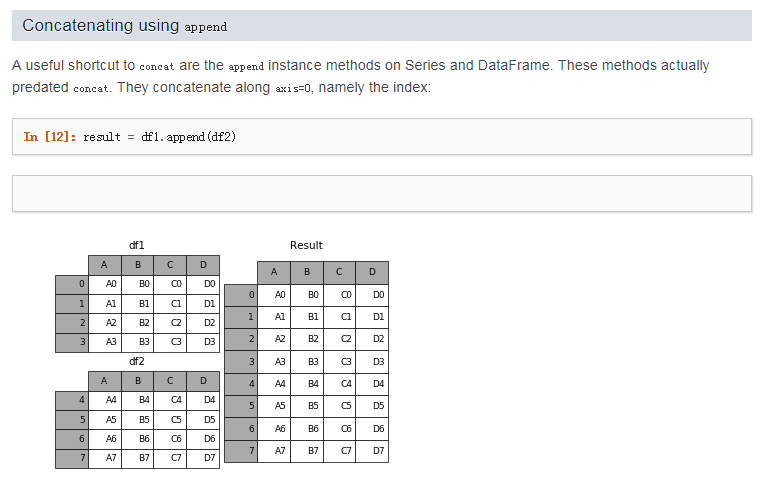

# 横向合并数据集

concat方法相当于数据库中的全连接(UNION ALL),可以指定按某个轴进行连接,也可以指定连接的方式join(outer,inner 只有这两种)。与数据库不同的时concat不会去重，要达到去重的效果可以使用drop_duplicates方法

轴向连接 pd.concat() 就是单纯地把两个表拼在一起，这个过程也被称作连接（concatenation）、绑定（binding）或堆叠（stacking）。因此可以想见，这个函数的关键参数应该是 axis，用于指定连接的轴向。



```python
concat(objs, axis=0, join='outer', join_axes=None, ignore_index=False,
           keys=None, levels=None, names=None, verify_integrity=False, copy=True):
objs 就是需要连接的对象集合，一般是列表或字典；
```
在默认的 axis=0 情况下，pd.concat([obj1,obj2]) 函数的效果与 obj1.append(obj2) 是相同的；
而在 axis=1 的情况下，pd.concat([df1,df2],axis=1) 的效果与 pd.merge(df1,df2,left_index=True,right_index=True,how='outer') 是相同的。
可以理解为 concat 函数使用索引作为“连接键”。

解析



