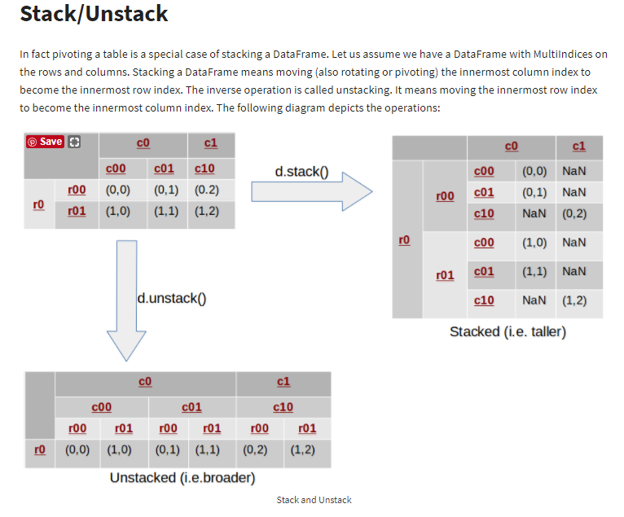
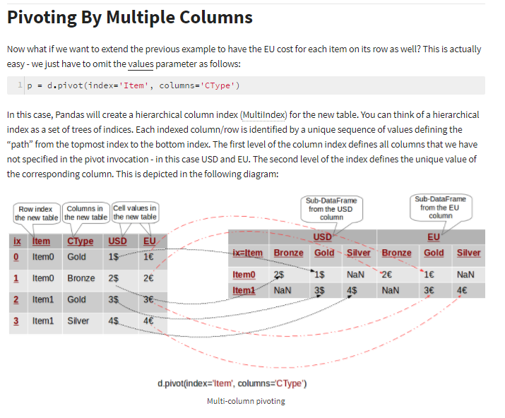
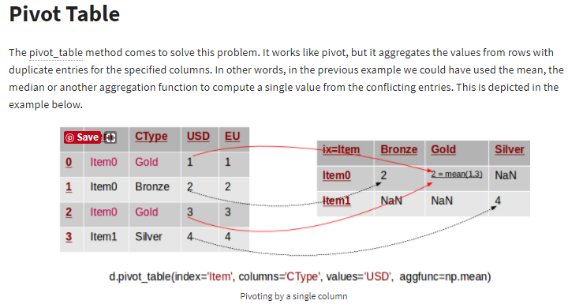

# 重塑重构数据

重塑(reshape) 或轴向旋转(pivot) 运算。

## 重塑层次化索引
* stack : 将数据的列"旋转"为行。
* unstack: 将数据的行"旋转"为列。
* pivot
* pivot_table

[Reshaping in Pandas - Pivot, Pivot-Table, Stack and Unstack explained with Pictures](http://nikgrozev.com/2015/07/01/reshaping-in-pandas-pivot-pivot-table-stack-and-unstack-explained-with-pictures/)

[reshaping-data-in-python](https://hackernoon.com/reshaping-data-in-python-fa27dda2ff77)
