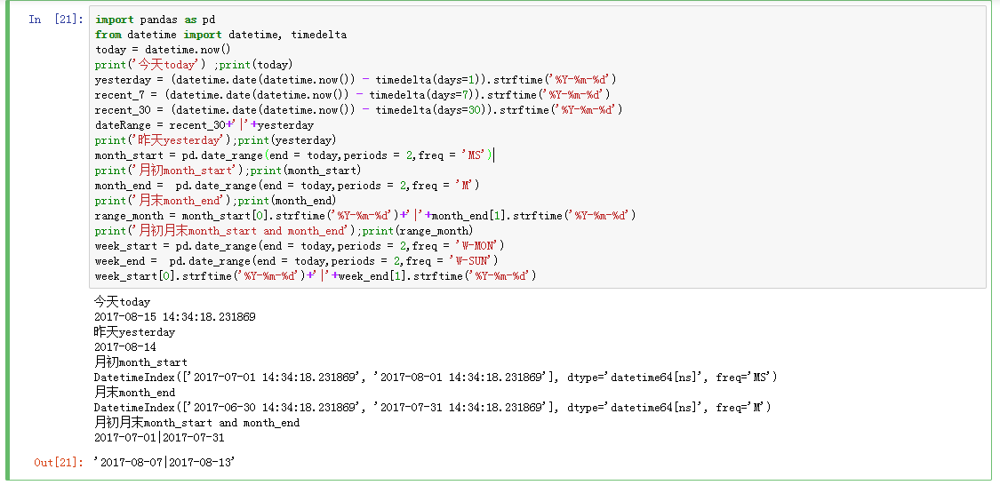

# 常见日期



```python
import pandas as pd
from datetime import datetime, timedelta
today = datetime.now()
print('今天today') ;print(today)
yesterday = (datetime.date(datetime.now()) - timedelta(days=1)).strftime('%Y-%m-%d')
recent_7 = (datetime.date(datetime.now()) - timedelta(days=7)).strftime('%Y-%m-%d')
recent_30 = (datetime.date(datetime.now()) - timedelta(days=30)).strftime('%Y-%m-%d')
dateRange = recent_30+'|'+yesterday
print('昨天yesterday');print(yesterday)
month_start = pd.date_range(end = today,periods = 2,freq = 'MS')
print('月初month_start');print(month_start)
month_end =  pd.date_range(end = today,periods = 2,freq = 'M')
print('月末month_end');print(month_end)
range_month = month_start[0].strftime('%Y-%m-%d')+'|'+month_end[1].strftime('%Y-%m-%d')
print('月初月末month_start and month_end');print(range_month)
week_start = pd.date_range(end = today,periods = 2,freq = 'W-MON')
week_end =  pd.date_range(end = today,periods = 2,freq = 'W-SUN')
week_start[0].strftime('%Y-%m-%d')+'|'+week_end[1].strftime('%Y-%m-%d')

```
## 常见日期
```python
##本月数据
yesterday = (datetime.date(datetime.now()) - timedelta(days=1)).strftime('%Y-%m-%d')
yesterday_30 = (datetime.date(datetime.now()) - timedelta(days=30)).strftime('%Y-%m-%d')
today = datetime.date(datetime.now()).strftime('%Y-%m-%d')
month_start = pd.date_range(end = today,periods = 1,freq = 'MS')[0].strftime('%Y-%m-%d')

df_day_30 = df_day[df_day['日期']>=yesterday_30]
df_day_month =  df_day[df_day['日期'] >= month_start ]

```


