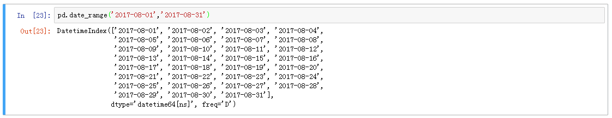
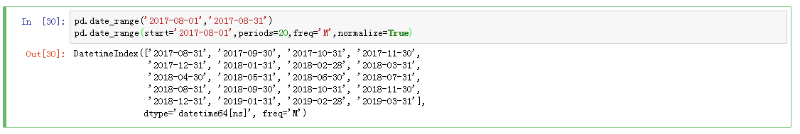
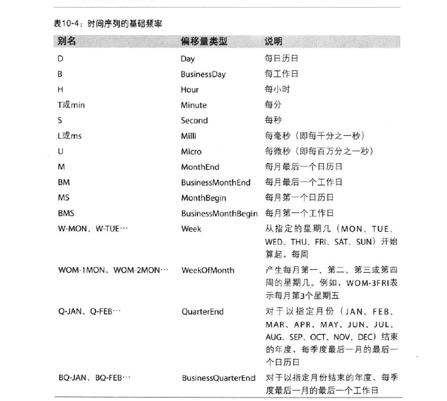
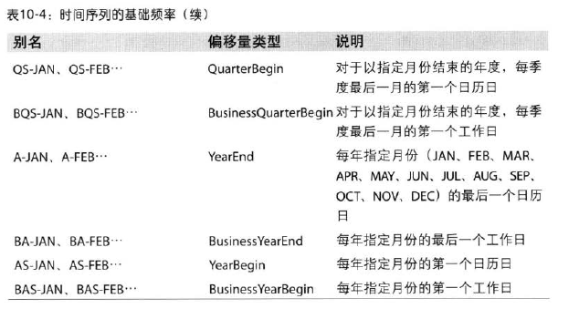
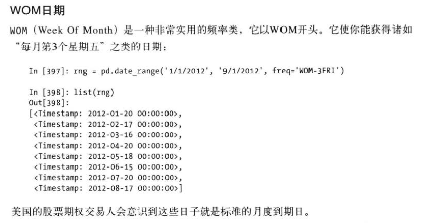
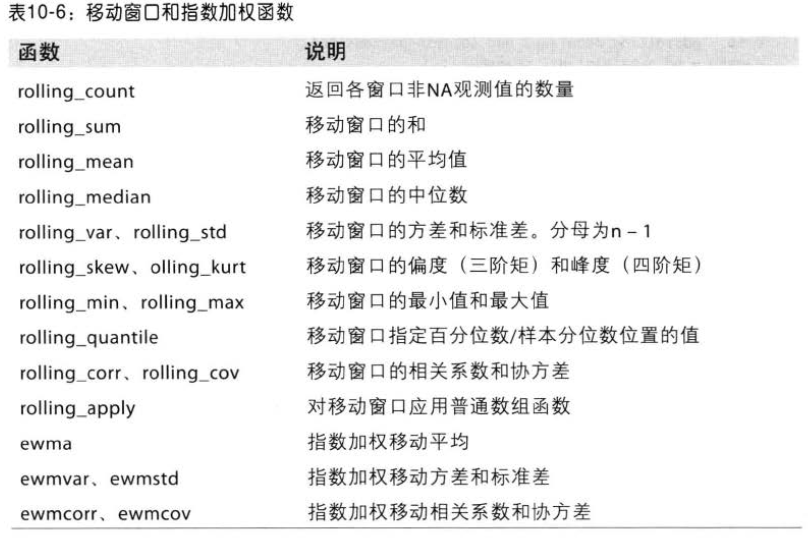

# 时间序列

pandas用NumPy的datetime64数据类型以纳秒形式存储时间戳:

pandas.date_range可用于生成指定长度的DatetimeIndex



## pandas 频率和日期偏移量





## 移动( 超前和滞后) 数据
移动( shifting ) 指的是沿着时间轴将敏据前移或后移。

## 移动窗口函数


## 二元移动窗口函数 百分比
百分数变化pct_change()

```python
def clean_table(table):
    table = table.sort_index(by=['日期'],ascending=False)
    table =table.drop_duplicates(['日期','店铺','日期类型'])

    table_sort  =   table.sort_index(by=['日期','店铺'],ascending=True).set_index(['日期','店铺','日期类型','日期范围'])
    table_change =  table.sort_index(by=['日期','店铺'],ascending=True).set_index(['日期','店铺','日期类型','日期范围']).pct_change()

    table_merge= pd.merge(table_sort.reset_index(),table_change.reset_index(),on=['日期','店铺','日期类型','日期范围'],suffixes=('','_环比'))
    table_merge = table_merge.sort_index(by=['日期'],ascending=False)
    print('数据清理完毕')
    return table_merge
```
