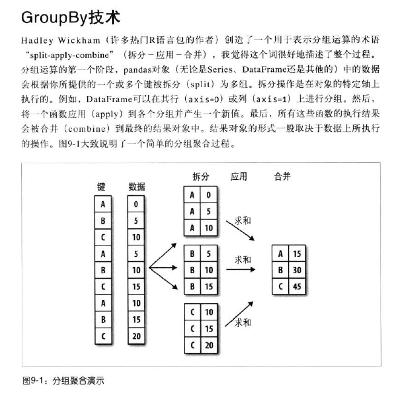
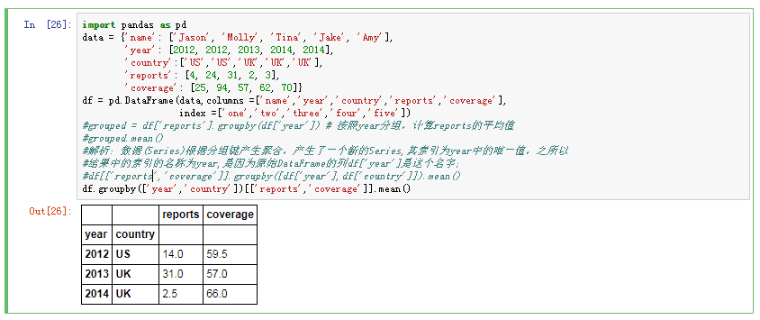

# groupBy分组运算

Group By: split-apply-combine
```sql
SELECT Column1, Column2, mean(Column3), sum(Column4)
FROM SomeTable
GROUP BY Column1, Column2
```



参考[groupby](https://pandas.pydata.org/pandas-docs/stable/groupby.html)


```python
import pandas as pd
data = {'name': ['Jason', 'Molly', 'Tina', 'Jake', 'Amy'],
        'year': [2012, 2012, 2013, 2014, 2014],
        'country':['US','US','UK','UK','UK'],
        'reports': [4, 24, 31, 2, 3],
        'coverage': [25, 94, 57, 62, 70]}
df = pd.DataFrame(data,columns =['name','year','country','reports','coverage'],
                  index =['one','two','three','four','five'])
#grouped = df['reports'].groupby(df['year']) # 按照year分组，计算reports的平均值
#grouped.mean()
#解析：数据(Series)根据分组键产生聚合，产生了一个新的Series,其索引为year中的唯一值，之所以
#结果中的索引的名称为year,是因为原始DataFrame的列df['year']是这个名字；
#df[['reports','coverage']].groupby([df['year'],df['country']]).mean()
df.groupby(['year','country'])[['reports','coverage']].mean()

```
