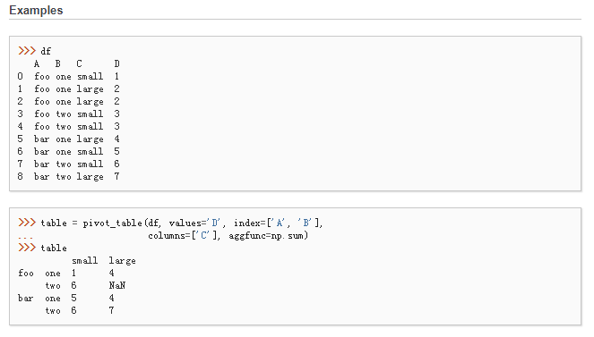
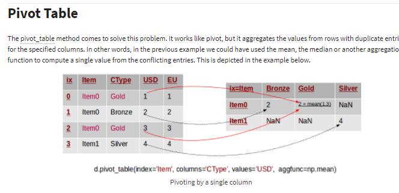
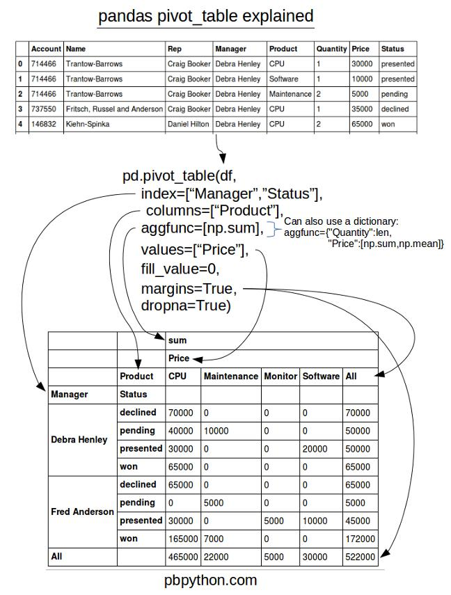
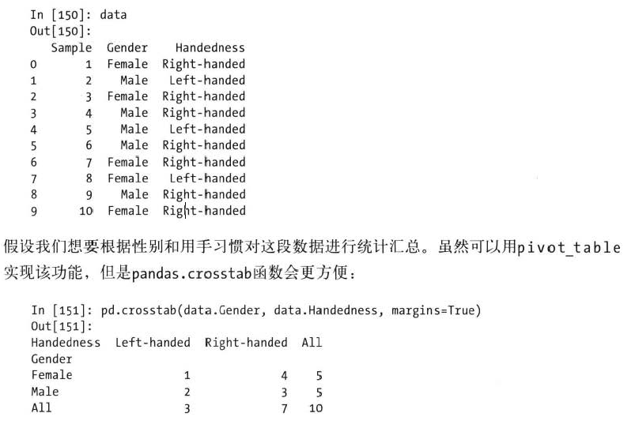

# 透视表和交叉表

## pivot_table

参考：[Pandas透视表（pivot_table）详解](http://python.jobbole.com/81212/)
[pandas-pivot-table-explained](http://pbpython.com/pandas-pivot-table-explained.html)

## 交叉表: crosstab
* 交叉表（cross-table），一种用于计算分组频率的特殊透视表

