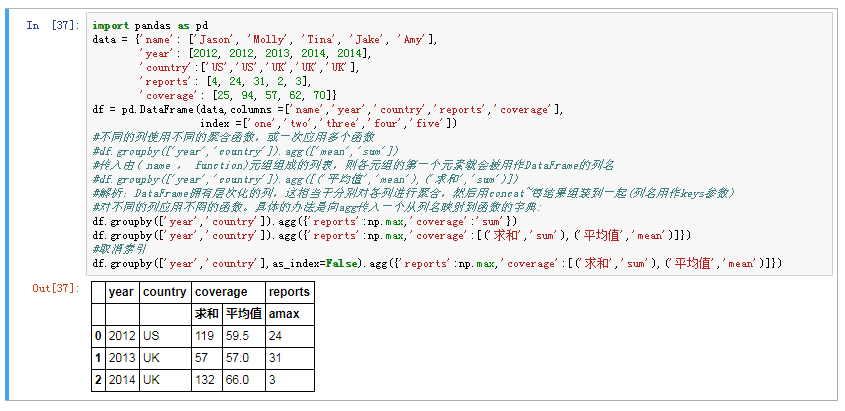
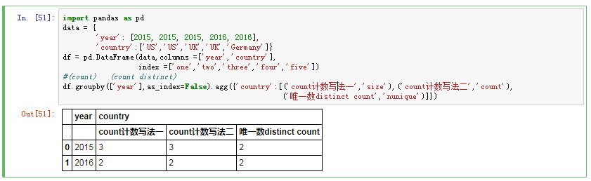

# 高级分组聚合
DataFrame列的聚合运算其实就是使用aggregate (使用自定义函数)或调用诸如mean 、std之类的方法;

* 对不同的列使用不同的聚合函数，或一次应用多个函数


```python
import pandas as pd
data = {'name': ['Jason', 'Molly', 'Tina', 'Jake', 'Amy'],
        'year': [2012, 2012, 2013, 2014, 2014],
        'country':['US','US','UK','UK','UK'],
        'reports': [4, 24, 31, 2, 3],
        'coverage': [25, 94, 57, 62, 70]}
df = pd.DataFrame(data,columns =['name','year','country','reports','coverage'],
                  index =['one','two','three','four','five'])
#不同的列使用不同的聚合函数，或一次应用多个函数
#df.groupby(['year','country']).agg(['mean','sum'])
#传入由( name ， function)元组组成的列表，则各元组的第一个元素就会被用作DataFrame的列名
#df.groupby(['year','country']).agg([('平均值','mean'),('求和','sum')])
#解析：DataFrame拥有层次化的列，这相当于分别对各列进行聚合，然后用concat~每结果组装到一起(列名用作keys参数)
#对不同的列应用不罔的函数。具体的办法是向agg传入一个从列名映射到函数的字典:
df.groupby(['year','country']).agg({'reports':np.max,'coverage':'sum'})
df.groupby(['year','country']).agg({'reports':np.max,'coverage':[('求和','sum'),('平均值','mean')]})
#取消索引
df.groupby(['year','country'],as_index=False).agg({'reports':np.max,'coverage':[('求和','sum'),('平均值','mean')]})

```

# group by count distinct



```python
import pandas as pd
data = {
        'year': [2015, 2015, 2015, 2016, 2016],
        'country':['US','US','UK','UK','Germany']}
df = pd.DataFrame(data,columns =['year','country'],
                  index =['one','two','three','four','five'])
#(count)   (count distinct)
df.groupby(['year'],as_index=False).agg({'country':[('计数count','size'),('唯一数distinct count','nunique')]})

```
